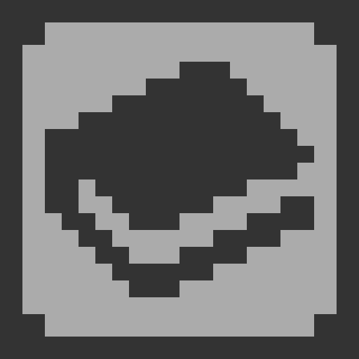

# 🛠️ M-Fixer: Mojang Directory Management

  
   
  <b>A powerful and stable file manager specifically designed for Minecraft PE on Android.</b>

  
  
  
  

---
## 🌟 Overview
**M-Fixer** is a specialized utility tool created to help Minecraft players manage their game directories effortlessly. Since Android 11, accessing `Android/data` has become a nightmare for many users. M-Fixer provides a bridge to manage **Resource Packs**, **Behavior Packs**, and **Worlds** without needing a PC or complex root access.
## 🚀 Key Features
* 🔓 **Scoped Storage Bypass**: Full support for Android 11, 12, 13, and 14+.
* 📍 **Direct Folder Mapping**: Instant access to the Mojang directory using smart SAF (Storage Access Framework) logic.
* 📂 **Add & Extract**: Easily add new `.mcpack` or `.mcworld` files directly to the game folders.
* 🧼 **Clean & Stable UI**: Modern Material Design interface with smooth navigation.
* 🛠️ **File Fixer**: Resolve common directory issues that prevent packs from showing up in-game.
## 🛠️ Built With
A selection of the tools and languages used in this project:
* **Kotlin**: For the core logic and modern Android development.
* **XML**: For building responsive and clean layouts.
* **Storage Access Framework (SAF)**: To handle modern Android security permissions.
* **DocumentFile API**: To manage files inside restricted system folders.
## 📸 Screenshots

| Startup | Folder Access | File Management |
| :--- | :--- | :--- |
|  |  |  |

## 📦 Requirements
* **Android Version**: 8.0 (Oreo) or higher.
* **Target SDK**: 34 (Android 14).
* **Minecraft PE**: Installed on your device.
## 🏗️ Development
If you want to build this project from source:
1. Clone this repository.
2. Open in **Android Studio (Iguana or newer)**.
3. Ensure you have **JDK 17** configured.
4. Sync Gradle and click **Run**.
---
## 🔗 Connect With Me
* **Developer**: [MohFahmiMc](https://github.com/MohFahmiMc)
* **GitHub**: [@MohFahmiMc](https://github.com/MohFahmiMc)
---

Made with ❤️ for the Minecraft Community

